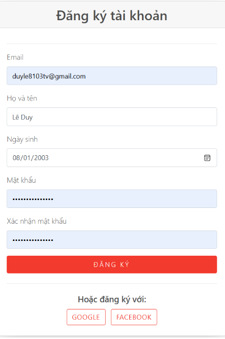
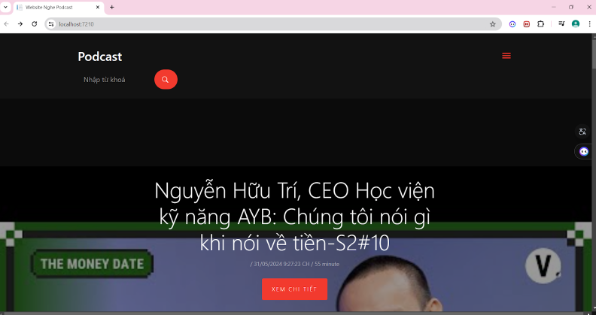
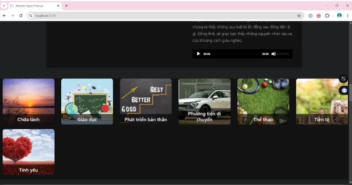
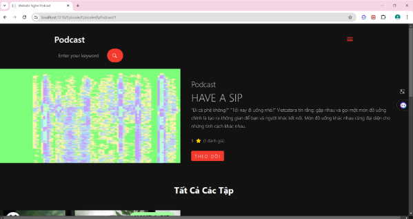
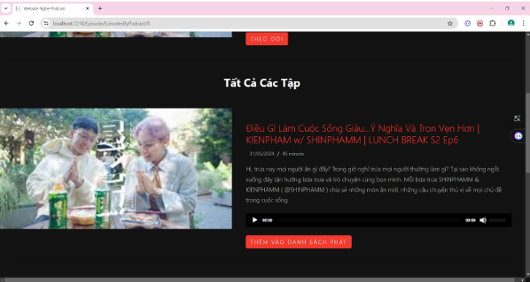
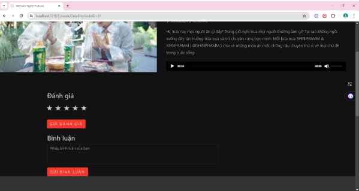
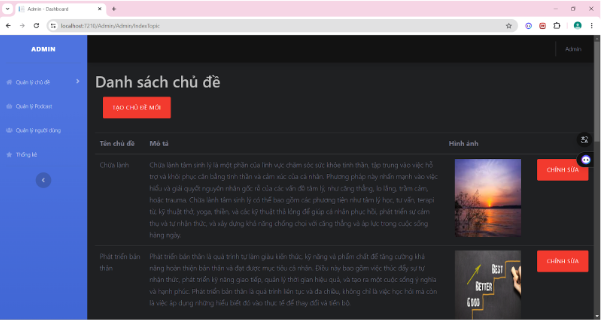

# PodcastWebsite
Foundation project with topic PodcastWebsite

Login using oath2 for user have multiple way to login throught google or facebook or create a simple accout

This is user home page for user to choose the podcast they want to listen to and it will auto display the podcast have the highest vote base on user vote and user also can make there own podcast.

When you click a podcast it will display all of the episode in that podcast

And inside you can vote for the podcast you like or comment to discuss about the podcast

And this is admin interface to manage website content and user.

